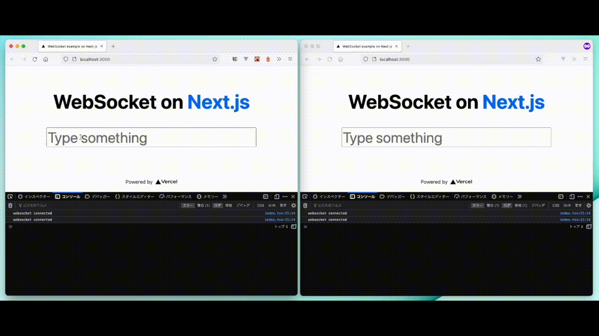

WebSocket on Next.js
==

This is example for WebSocket on Next.js.



Log
--

```sh
$ yarn create next-app -e https://github.com/jpedroschmitz/typescript-nextjs-starter
$ yarn add socket.io socket.io-client
```

res.socket.server:

- [next.NextApiResponse](https://github.com/vercel/next.js/blob/bd3dfe1f4b589222187ded1077b6248affc0cf07/packages/next/shared/lib/utils.ts#L229-L265)
  - [http.ServerResponse](https://github.com/DefinitelyTyped/DefinitelyTyped/blob/master/types/node/http.d.ts#L464-L568)
    - [http.OutgoingMessage](https://github.com/DefinitelyTyped/DefinitelyTyped/blob/master/types/node/http.d.ts#L326-L458)
      - [net.Socket](https://github.com/DefinitelyTyped/DefinitelyTyped/blob/master/types/node/net.d.ts#L77-L377)
